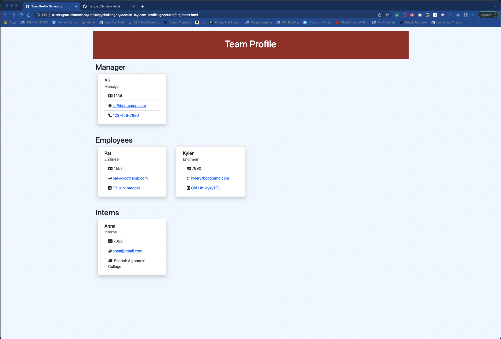

# Team Profile Generator

## Purpose

This is an app that allows you to build an HTML Team Profile page by simply answering a few prompted questions in the command line of your terminal.

## Built With

- JavaScript
- HTML
- CSS
- Bootstrap
- Font Awesome
- Node.js
- Express.js
- Inquirer

## Usage

https://github.com/narcpat/team-profile-generator

Click below for a video demonstration

## Contribution

Made with ❤️ Patrick Narcisse (aka narcpat)

## Credits

I made use of our previous "Portfolio Generator" app as well as the "README Generator" for much of the logic in building this app.

I've also made use of the following sites/pages throughout the building of this app:

- https://nodejs.org/api/fs.html
- https://expressjs.com/en/4x/api.html

## Special Thanks

A big thank you to my instructors Ali, Devon and Mija, who each helped me get unstuck at various stages.
